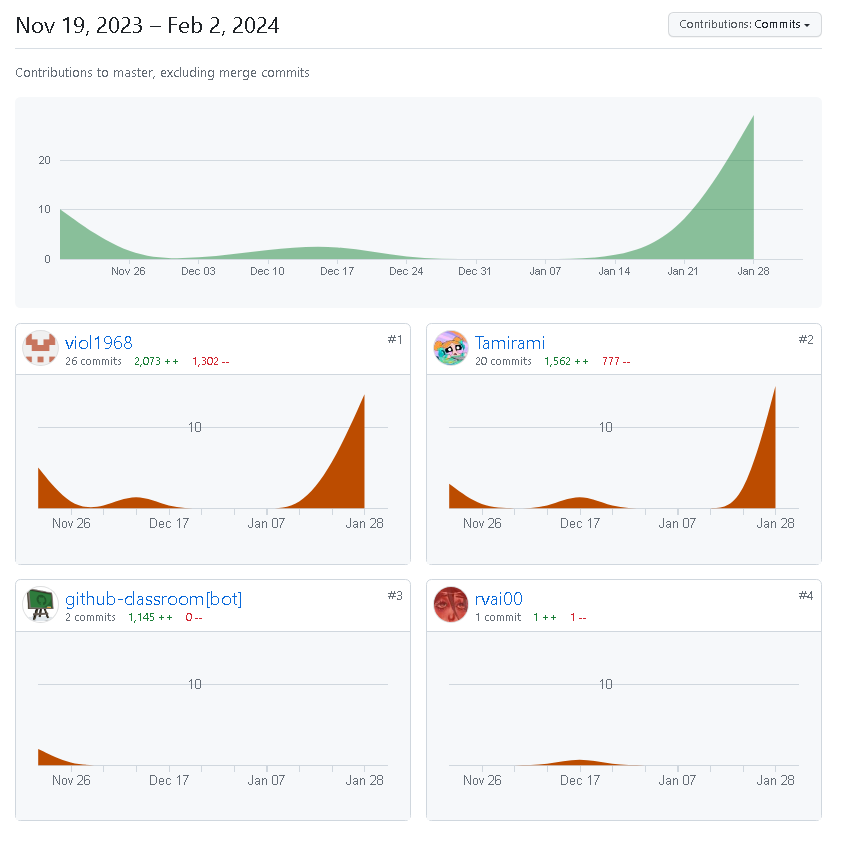

```{r load-packages, include = FALSE}
# Add any additional packages you need to this chunk
library(tidyverse)
library(tidymodels)
library(palmerpenguins)
library(knitr)
library(xaringanthemer)
library(datasets)
library(ggplot2)
library(kableExtra)
library(corrplot)
library(cowplot)
library(viridis)
library(patchwork)
```

```{r setup, include=FALSE}
# For better figure resolution
knitr::opts_chunk$set(fig.retina = 3, dpi = 300, fig.width = 6, fig.asp = 0.618, out.width = "75%")
```

```{r, include=FALSE}
getwd()
```

```{r, include=FALSE}
# Specify the path to your CSV file
file_path <- "Sleep_dataset.csv"

# Load data from the CSV file into a data frame
Sleep_dataset <- read.csv(file_path)

```

```{r theme, echo=FALSE}

style_xaringan(
  title_slide_background_image = "img/tłobluepink.png"
  
)
style_mono_accent(
  base_color = "#2C436F", # kolr tekstu nagłówka 
  background_color = "#D996A7", # kolor tła
  inverse_background_color = "#9AC3E6", # inverse kolor tła
  inverse_header_color = "#FFFFFF",     # linverse kolor nagłówka
  text_color = "#FFFFFF", # kolor tekstu
  inverse_text_color = "#FFFFFF" # inverse kolor tekstu
  ) 

```


class: center, middle


# Cel Badawczy 
Nasze badanie ma na celu analizę zestawu danych dotyczących snu i stylu życia, ze szczególnym uwzględnieniem zawodów respondentów. Naszym głównym celem jest identyfikacja potencjalnych zależności i wzorców, przy skoncentrowaniu uwagi nie tylko na różnicach między poszczególnymi profesjami, ale także na powiązaniach z poziomem doświadczanego stresu. Chcemy lepiej zrozumieć, czy istnieją konkretne grupy zawodowe, które bardziej niż inne doświadczają trudności związanych ze snem i czy te trudności mogą być powiązane z poziomem stresu w danym środowisku zawodowym.


---
class: center, middle

# O bazie danych
Zestaw danych dotyczący snu i stylu życia zawiera 400 wierszy i 13 kolumn, obejmujących szeroki zakres zmiennych związanych ze snem i codziennymi nawykami. Zmienne, na podstawie których została wykonana analiza to:

```{r wyświetlenie_zmiennych, echo=FALSE}
names(Sleep_dataset)
```

---
class: inverse, center, middle

# Dane demograficzne:

```{r rozkład wieku, echo=FALSE, fig.height=6, fig.width=8, warning=FALSE}
library(ggplot2)
# funkcja do ustawienia kolorów dla tytułów i tła wykresów
set_plot_colors <- function(plot, title_color, background_color) {
  plot + 
    theme(plot.title = element_text(color = title_color)) +
    theme(panel.background = element_rect(fill = background_color))
}
# wykres płci
plot_gender <- ggplot(Sleep_dataset, aes(x = Gender, fill = Gender)) +
  geom_bar(show.legend = FALSE) +
  geom_text(aes(label = after_stat(count)), stat = "count", vjust = 1.5, colour = "white") +
  labs(title = "Rozkład płci", x = "Płeć", y = "Ilość osób") +
  theme_xaringan() +
  theme(
    plot.background = element_rect(fill = "#9AC3E6")    # Kolor tła obszaru całego wykresu
  )

# wykres wieku
plot_age <- ggplot(Sleep_dataset, aes(x = Age, fill = Age)) +
  geom_histogram(binwidth = 5, position = "identity", fill = "#F28705") +
  scale_fill_viridis_c() +
  labs(title = "Rozkład Wieku", x = "Wiek", y = "Ilość osób") +
  theme_xaringan() +
  theme(
    plot.background = element_rect(fill = "#9AC3E6")    # Kolor tła obszaru całego wykresu
  )

# ustawienie kolorów tła 7
plot_gender <- set_plot_colors(plot_gender, "#2C436F", "#9AC3E6")
plot_age <- set_plot_colors(plot_age, "#2C436F", "#9AC3E6")

# umieszczenie wykresów na slajdzie obok siebie
combined_plot <- plot_grid(plot_gender, plot_age, ncol = 2)

print(combined_plot)
```

---

class: center, middle

# Najistotniejsze statystyki dla tej analizy:
```{r średnie_mediany, echo=FALSE}
#  średnie
averages <- Sleep_dataset %>%
  summarise(
    Sleep_Duration = mean(Sleep.Duration, na.rm = TRUE),
    Quality_of_Sleep = mean(Quality.of.Sleep, na.rm = TRUE),
    Stress_Level = mean(Stress.Level, na.rm = TRUE)
  )

# mediany
medians <- Sleep_dataset %>%
  summarise(
    Sleep_Duration = median(Sleep.Duration, na.rm = TRUE),
    Quality_of_Sleep = median(Quality.of.Sleep, na.rm = TRUE),
    Stress_Level = median(Stress.Level, na.rm = TRUE)
  )
```

```{r printing, echo=FALSE}
print("Średnie:")
print(averages)

print("Mediany:")
print(medians)

```

---

class: inverse, center, middle
# Analiza korelacji między zmiennymi

```{r, echo=FALSE}
# set.seed(42)
# cor(Sleep_dataset[c(3, 5, 6, 7, 8, 11, 12)])

numeric_Sleep_dataset <- Sleep_dataset[sapply(Sleep_dataset, is.numeric)]

correlation_matrix <- cor(numeric_Sleep_dataset)

# Plot the correlation matrix with smaller font size
corrplot(correlation_matrix, method="color", addCoef.col="black", tl.col="black", tl.srt=45, number.cex=0.7)

```

---

class: center, middle
#Jakość snu vs długość


```{r jakość_snu__vs_długość, echo=FALSE, message=FALSE, warning=FALSE}
ggplot() + 
  geom_point(data = Sleep_dataset, mapping = aes(x = Quality.of.Sleep, y = Sleep.Duration)) +
  geom_smooth(data = Sleep_dataset, mapping = aes(x = Quality.of.Sleep, y = Sleep.Duration)) +
labs(title = "Wykres punktowy",
         subtitle = "Zależność między jakością a długością snu",
         x = "Jakość Snu",
         y = "Długość Snu") +
    theme_minimal()
```

---
class:center, middle
#Jakość snu vs stres

```{r jakość_snu_vs_stres, echo=FALSE, message=FALSE, warning=FALSE}
ggplot() + 
  geom_point(data = Sleep_dataset, mapping = aes(x = Stress.Level, y = Sleep.Duration)) +
  geom_smooth(data = Sleep_dataset, mapping = aes(x = Stress.Level, y = Sleep.Duration)) +
  labs(title = "Wykres punktowy",
         subtitle = "Zależnośś jakości snu od poziomu stresu",
         x = "Jakość Snu",
         y = "Poziom Stresu") +
    theme_minimal()
```

---
class: inverse, center, middle
#Ilość dziennych kroków vs stres
```{r steps_vs_stres, echo=FALSE, message=FALSE, warning=FALSE}
ggplot(Sleep_dataset, aes(x = Daily.Steps, y = Stress.Level)) +
  geom_point() +
  labs(title = "Zależność ilości dziennych kroków od poziomu stresu",
       x = "Ilość kroków w ciągu dnia",
       y = "Poziom Stresu")
```

---
class:center, middle
#Wykonywane zawody przez badanych

```{r zawody, echo=FALSE}
#Wykonywane zawody przez badanych
ggplot(Sleep_dataset, aes(x = Occupation, fill=Occupation)) +
  geom_bar() +
  labs(title = "Rozkład profesji", y = "Ilość osób") +
  theme(axis.text.x=element_text(size=10, angle=45,hjust=0.95))
```
---
class:center, middle
#Relacja między profesją a poziomem stresu
.pull-left[
Lekarze, pielęgniarki i przedstawiciele handlowi doświadczali najwyższych poziomów stresu w porównaniu do innych zawodów. To sugeruje, że specyfika tych zawodów może wpływać na poziomy stresu u pracowników.

]
.pull-right[
```{r zawód_stres, echo=FALSE}
ggplot(Sleep_dataset, aes(x = Stress.Level, fill=as.factor(Stress.Level))) + 
  geom_bar() +
  labs(x = "Ilość", y = "Profesja") +
  scale_fill_discrete(name = "Poziom Stresu") +
  facet_wrap(vars(Occupation))
```

]

---
class: inverse, center, middle
#Długość snu a wykonywany zawód

```{r zawód_długość, echo=FALSE}
ggplot(Sleep_dataset, aes(y = `Sleep.Duration`)) +
  geom_bar() +
  labs(x = "Profesja", y = "Długość Snu") +
  theme(axis.text.x=element_text(size=7, angle=90,hjust=0.99)) +
  facet_wrap(vars(Occupation))
```

---
class:center, middle
#Relacja: ilość dziennych kroków a profesja

```{r zawód_kroki, echo=FALSE}
ggplot() + 
  geom_boxplot(data = Sleep_dataset, mapping = aes(y = `Daily.Steps`, x = Occupation)) +
  theme(axis.text.x=element_text(size=10, angle=45,hjust=0.95))
```


---
class: inverse, center, middle
# Zaburzenia snu wśród różnych profesji

```{r zawód_zaburzenia, echo=FALSE} 
Sleep_dataset$Occupation <- factor(Sleep_dataset$Occupation, levels = unique(Sleep_dataset$Occupation))

# Create the plot
ggplot(Sleep_dataset, aes(x = Occupation, fill = Sleep.Disorder)) +
  geom_bar(position = "dodge", color = "black", alpha = 0.8) +
  labs(title = "Częstotliwość występowania zaburzeń snu",
       subtitle = "w poszczególnych profesjach",
       x = "Profesja",
       y = "Ilość",
       fill = "Zaburzenie snu") +
  scale_fill_manual(values = c("Sleep Apnea" = "lightblue", "Insomnia" = "salmon", "None" = "yellow")) +
  theme_minimal() +
  theme(axis.text.x = element_text(angle = 45, hjust = 1),
        legend.position = "top") +
  labs(fill = "Sleep Disorder")
```

---
class: center, middle

#Podsumowanie
Analiza danych dotyczących snu i stylu życia ujawniła, że istnieje silna korelacja między czasem trwania snu a poziomem stresu, gdzie osoby śpiące więcej wykazywały niższe poziomy stresu. Ponadto, zauważono, że dłuższy sen koreluje pozytywnie z lepszą jakością snu. W kontekście zawodów, lekarze, pielęgniarki i przedstawiciele handlowi doświadczali najwyższych poziomów stresu w porównaniu do innych zawodów, podczas gdy pielęgniarki wyróżniały się największą aktywnością fizyczną. Różnice płciowe również wpływały na poziomy stresu, a analiza zawodów ujawniła zróżnicowanie w wzorcach snu. Wskazuje to na kompleksowy wpływ snu, stresu i aktywności fizycznej na zdrowie ogólne, co może być istotne dla opracowania zaleceń dotyczących nawyków snu.
---
class: center, middle
#Nasz wkład

---
class: inverse, center, middle
background-image: url(https://sozaino.site/wp-content/uploads/2023/07/guradesora16.png?fbclid=IwAR1QT6qaMG0q8ZEb58hSTHr18KEJGSuZbGdMJt1Wj_qI8II8UMxAZ3q2hnE)
# Dziękujemy za uwagę

---
